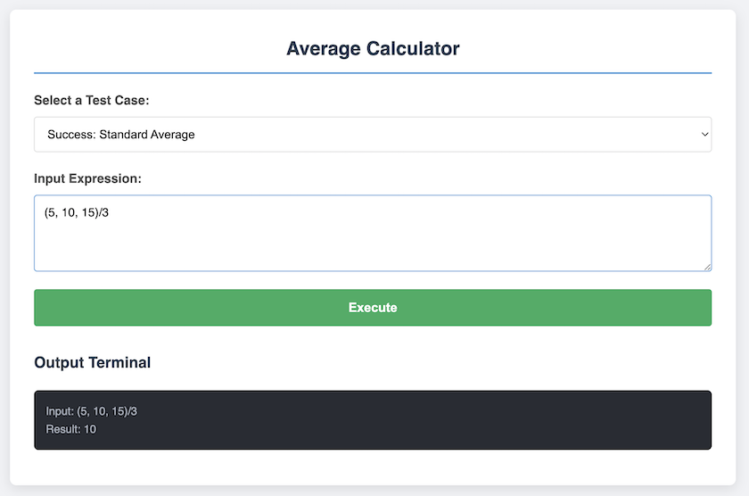
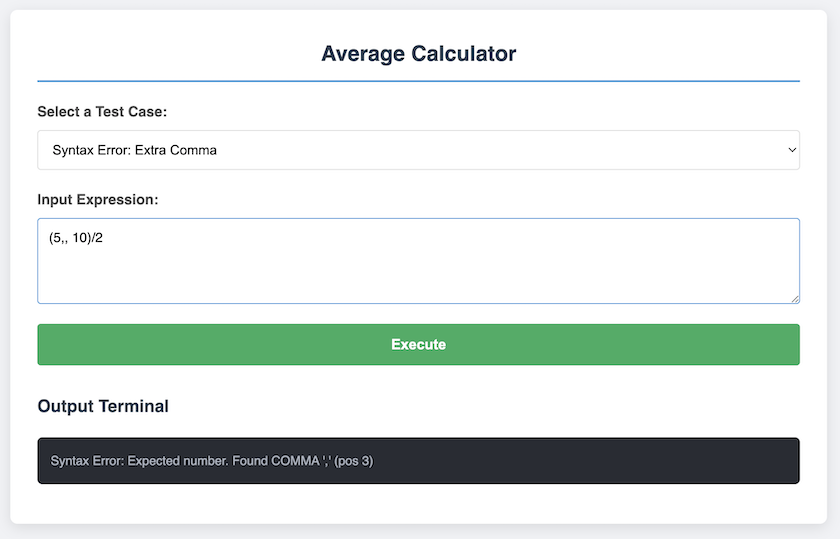

# Average Calculator -- Lexical Analyzer and Parser

## 1. Project Overview

This project implements a small language processor that evaluates
expressions of the form:

    (1,2,3.0)/3

The program computes:

-   Size of the list
-   Sum of all numbers
-   Average value

The implementation follows a compiler-style architecture:

Input → Lexical Analysis → Parsing → AST Construction → Semantic
Analysis → Evaluation → Output

------------------------------------------------------------------------

## 2. Language Grammar

The supported grammar is:
```text
expression := "(" number { "," number } ")" "/" number
```
Example valid input:

    (5, 10, 15.1) / 3

------------------------------------------------------------------------

## 3. UI Demo (Screenshots)
**Valid input**

**Error syntax**


------------------------------------------------------------------------

## 4. System Design

### 4.1 Lexical Analysis

The Lexer reads the input character-by-character and converts it into
tokens.

Supported token types:

-   NUMBER
-   COMMA (`,`)
-   SLASH (`/`)
-   LPAREN (`(`)
-   RPAREN (`)`)
-   EOF

The lexical analyzer:

-   Groups digits into integers or floats
-   Ignores whitespace
-   Detects invalid characters

------------------------------------------------------------------------

### 4.2 Parsing (Recursive Descent Parser)

The parser is implemented using recursive descent.

It:

-   Validates syntax
-   Reports syntax errors with position information
-   Builds an Abstract Syntax Tree (AST)
-   Uses recursion to traverse the AST

------------------------------------------------------------------------

### 4.3 Abstract Syntax Tree (AST)

The program constructs an AST using:

-   `NumberNode`
-   `ListNode`
-   `DivisionNode`

The AST clearly separates:

-   The left list `( ... )`
-   The divide operator '/'
-   The right number `number`

This ensures correct semantic validation and evaluation.

------------------------------------------------------------------------

### 4.4 Semantic Analysis

After parsing:

1.  All numbers from the left list are collected using recursion.
2.  The program verifies that:
    -   The list is not empty.
    -   The denominator (the number after /) equals the number of elements in the left list.
3.  If validation passes:
    -   Size is computed.
    -   Sum is computed.
    -   Average = Sum / Size.

------------------------------------------------------------------------

## 5. Debug Mode

Debug mode prints internal processing steps in the browser console.

Example logs:
```text

Lexical -> ( | 5 | , | 1 0 | , | 1 5 | ) | / | 3
Group   -> ( | 5 | , | 10 | , | 15 | ) | / | 3
Token   -> LPAREN NUMBER COMMA NUMBER COMMA NUMBER RPAREN SLASH NUMBER

    check syntax: expect LPAREN, got LPAREN '(' Position 0
    check syntax: expect NUMBER, got NUMBER '5' Position 1
    check syntax: expect COMMA, got COMMA ',' Position 2
    check syntax: expect NUMBER, got NUMBER '10' Position 4
    check syntax: expect COMMA, got COMMA ',' Position 6
    check syntax: expect NUMBER, got NUMBER '15' Position 8
    check syntax: expect RPAREN, got RPAREN ')' Position 10
    check syntax: expect SLASH, got SLASH '/' Position 11
    check syntax: expect NUMBER, got NUMBER '3' Position 12
    check syntax: expect EOF, got EOF '' Position 13
```
To enable debug mode:

``` javascript
const DEBUG = true;
const tokens = new Lexer(code, DEBUG).getAllTokens();
const result = new Parser(tokens, DEBUG).parseList();
```

------------------------------------------------------------------------

## 6. Error Handling

The program handles:

- Lexical Errors: invalid characters and invalid number formats.

- Syntax Errors: missing parentheses, missing commas, missing /, missing denominator, and invalid token order.

- Semantic Errors: empty list, invalid denominator, and a denominator that does not match the number of elements in the left list.

------------------------------------------------------------------------

## 7. References

1.  GeeksforGeeks. Introduction to Lexical Analysis.\
    https://www.geeksforgeeks.org/compiler-design/introduction-of-lexical-analysis/

2.  University of Toronto. Parsing -- Recursive Descent Parser Notes.\
    https://www.cs.utoronto.ca/~trebla/CSCC24-latest/08-parsing.html

3.  McGill University. Abstract Syntax Trees (AST) -- CS520 Slides.\
    https://www.cs.mcgill.ca/~cs520/2020/slides/4-ast.pdf
